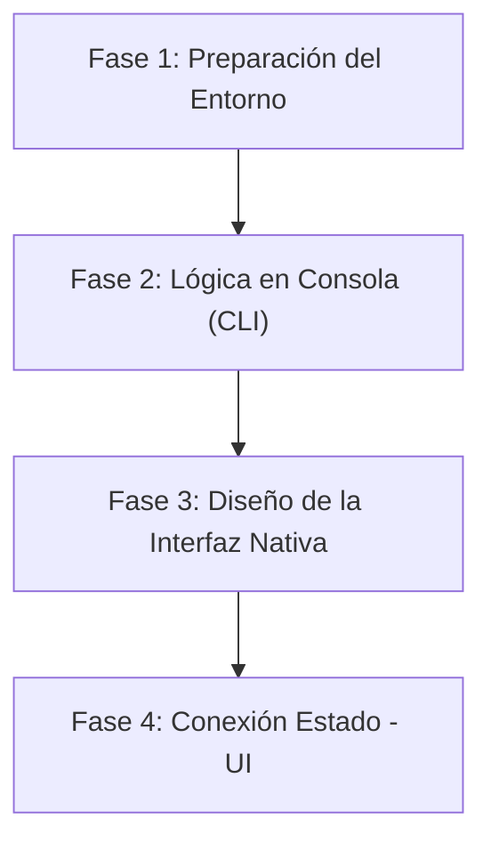

# Informe y Guía de Inicio: Aprendizaje Autodidacta de Rust

**Proyecto Práctico:** Aplicación de Escritorio - Generador de Frases Célebres

---

## 1. Enfoque del Aprendizaje Autodidacta (Rol de Tutor)

Para garantizar un aprendizaje real y efectivo:

- **Cero código dictado de Rust:** No se proporcionará código listo par[v]()a copiar y pegar. Tu trabajo será escribir el código, aprender a interpretar los mensajes del compilador de Rust (*el mejor profesor que existe*) y experimentar.
- **Rol de orientación y enseñanza:** Se explicarán los conceptos teóricos, reglas de sintaxis, modelos de memoria, arquitectura de la aplicación, comandos y solución a dudas conceptuales o errores del compilador cuando te quedes atascado.

---

## 2. Instalación y Configuración del Entorno de Rust en Windows

Rust utiliza una herramienta oficial llamada **`rustup`** para administrar la versión del compilador, el gestor de paquetes y las herramientas del sistema.

### Paso 1: Prerrequisitos en Windows (Compilador C++)

Rust en Windows requiere un compilador de C++ subyacente para enlazar binarios nativos.

1. Descarga e instala **Visual Studio Community** o **Build Tools for Visual Studio**.
2. Durante la instalación, selecciona la carga de trabajo: **"Desarrollo para el escritorio con C++"** (C++ build tools).

### Paso 2: Instalar Rust vía `rustup`

1. Visita la página oficial: [rustup.rs](https://rustup.rs).
2. Descarga y ejecuta `rustup-init.exe`.
3. Sigue las instrucciones en consola (opción 1 por defecto para la instalación estándar).

### Paso 3: Verificación de Instalación

Abre una nueva terminal (PowerShell o CMD) y verifica que las herramientas estén en tu `PATH`:

```powershell
rustc --version    # Muestra la versión del compilador de Rust
cargo --version    # Muestra la versión de Cargo (gestor de proyectos y paquetes)
```

---

## 3. Configuración del Editor (VS Code)

Para trabajar de manera cómoda en Rust con VS Code, es indispensable instalar las siguientes extensiones desde el Marketplace:

1. **`rust-analyzer` (Esencial):**

   - Es el servidor de lenguaje oficial para Rust. Proporciona autocompletado inteligente, inferencia de tipos visuales, detección de errores en tiempo real y sugerencias de lifetimes/ownership.
   - *> [!IMPORTANT] Nota: Desinstala o deshabilita la antigua extensión llamada simplemente "Rust", ya que está en desuso y genera conflictos.*
2. **`Even Better TOML` (Recomendada):**

   - Ofrece resaltado de sintaxis, validación y formateo para los archivos de configuración de Rust (`Cargo.toml`).
3. **`CodeLLDB` (Recomendada):**

   - Permite depurar (*debuggear*) aplicaciones Rust nativas poniendo puntos de interrupción (breakpoints) e inspeccionando variables en VS Code.
4. **`Blueprint` (Opcional para UI):**

   - Si decides utilizar Blueprint para el diseño gráfico, instala la extensión de resaltado de sintaxis para archivos `.blp`.

---

## 4. ¿Qué es Blueprint y cómo se relaciona con las UIs Nativas?

### ¿Qué es Blueprint?

**Blueprint** (`blueprint-compiler`) es un lenguaje de marcado declarativo moderno creado por la comunidad de GNOME para diseñar interfaces de usuario dentro del ecosistema **GTK4 / Libadwaita**.

- **Propósito:** Reemplaza la escritura manual de archivos XML verbosos de GTK por una sintaxis limpia, legible y jerárquica (similar a CSS/JSON conciso).
- **Cómo funciona:** El archivo `.blp` que escribes se compila hacia un archivo XML `.ui` tradicional de GTK, el cual tu aplicación en Rust carga en tiempo de ejecución para renderizar ventanas, botones y etiquetas nativas del sistema operativo.

### Cómo encaja con Rust

En Rust, el ecosistema de GTK4 se utiliza a través de bibliotecas como:

- `gtk4-rs`: Bindings directos de GTK4 para Rust.
- **Relm4:** Un framework guiado por arquitectura estilo Elm/Model-View-Update (MVU) construido sobre GTK4 que simplifica enormemente la creación de UIs en Rust.

### Instalación de Blueprint

Blueprint está escrito en Python. Para usarlo en Windows:

1. Asegúrate de tener Python instalado.
2. Instala el compilador mediante `pip`:
   ```bash
   pip install blueprint-compiler
   ```

> [!NOTE] ✏️ Alternativas de UI 100% Rust puro (Sin dependencias externas como GTK)
> Si deseas explorar otras opciones de UI nativa sin HTML/CSS/JS y escritas enteramente en Rust:
>
> - **Slint:** Excelente framework de UI declarativo nativo, súper liviano y muy amigable en Windows. Usa su propio lenguaje `.slint`.
> - **Iced:** Framework de UI declarativo e inspirado en Elm, escrito 100% en código Rust (sin archivos de marcado externos).
> - **egui:** Biblioteca de UI inmediata (*immediate mode*), muy rápida e ideal para herramientas sencillas.

---

## 5. Estructura Estándar de un Proyecto en Rust (Cargo)

Cuando creas un proyecto en Rust utilizando Cargo, se genera automáticamente una estructura estandarizada:

```text
mi_proyecto/
├── .gitignore          # Archivos a ignorar en Git (ej. carpeta target)
├── Cargo.toml          # Manifiesto del proyecto (metadatos y dependencias)
├── Cargo.lock          # Registro exacto de versiones instaladas (autogenerado)
├── src/                # Código fuente en Rust
│   ├── main.rs         # Punto de entrada de la aplicación binaria
│   └── lib.rs          # (Opcional) Módulos o lógica de biblioteca reusable
├── ui/                 # (Opcional) Archivos de interfaz gráfica (.blp o .slint)
├── assets/             # (Opcional) Recursos estáticos (imágenes, JSON de citas)
└── target/             # Binarios compilados y artefatos temporales (autogenerado)
```

### Explicación de componentes clave:

- **`Cargo.toml`:** Es el archivo equivalente a `package.json` en Node.js o `pyproject.toml` en Python. Aquí defines el nombre del proyecto, versión, versión de Rust y las librerías externas (*crates*) que necesita tu programa.
- **`src/main.rs`:** Contiene la función principal `fn main()`, que es donde comienza la ejecución del programa.
- **`target/`:** Es la carpeta donde el compilador coloca los archivos binarios compilados (`.exe` en Windows). Nunca se edita manualmente y suele ignorarse en control de versiones.

---

## 6. Hoja de Ruta Sugerida para el Proyecto "Generador de Citas"

A continuación se detalla la secuencia lógica para construir tu aplicación paso a paso:



### Fase 1: Creación del Proyecto

- Crear la estructura con `cargo new quote_generator`.
- Explorar los archivos generados y ejecutar el comando `cargo run`.

### Fase 2: Lógica de Datos y Selección Aleatoria (Consola)

- Aprender los conceptos de Rust:
  - Definición de tipos de datos para representar una Cita (texto del inicio del libro, título del libro, autor).
  - Listas/Vectores en memoria.
  - Selección de elementos al azar (introducción al uso de *crates* como `rand`).
- Imprimir citas aleatorias por consola.

### Fase 3: Diseño de la Interfaz Nativa

- Seleccionar la pila gráfica (GTK4 + Blueprint, Slint, o Iced).
- Diseñar la ventana contenedora:
  - Área de texto grande para mostrar la frase célebre (ej. inicio de *Cien años de soledad* o *Anna Karenina*).
  - Área secundaria para el autor y libro.
  - Botón interactivo: "Siguiente Frase".

### Fase 4: Integración y Manejo de Estado

- Comprender el modelo de memoria de Rust al manejar eventos del botón:
  - Ownership (propiedad de variables).
  - Borrowing y referencias mutables/inmutables.
- Actualizar el contenido de la pantalla al hacer clic en el botón.

---

## 7. Próximos Pasos Recomendados

1. Realiza la instalación de **Rust** y **VS Code** con la extensión `rust-analyzer`.
2. Confirma cuando tengas listo tu terminal y tu editor para dar el primer paso: **crear tu primer proyecto con Cargo y analizar `Cargo.toml` y `main.rs`**.
